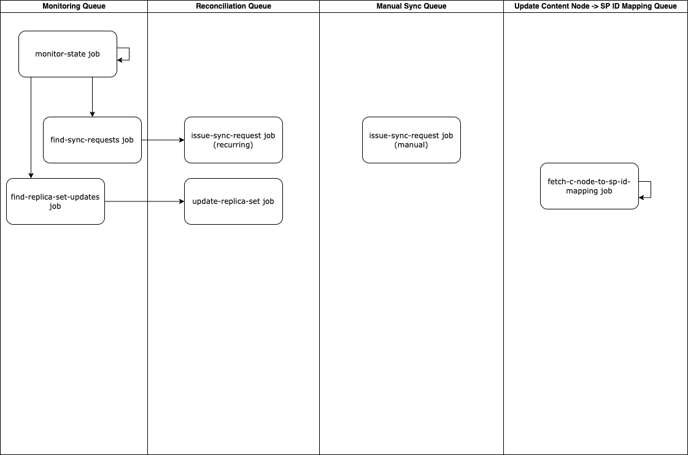

# State Machine Manager

Collection of services to search for state anomalies (out of sync data or other issues caused by unhealthy nodes) and fix them.

## Queues and Jobs
At a high level, the Monitoring Queue continuously enqueues 3 jobs, two of which (find-sync-requests and find-replica-set-updates) adds jobs to the Reconciliation Queue. Then, the Reconciliation Queue executes jobs to fix the state of the system.

Edit diagram [here](https://viewer.diagrams.net/?tags=%7B%7D&highlight=0000ff&edit=_blank&layers=1&nav=1&title=StateMachineDemo.drawio#R7Vpdk5s2FP01nmkf6IBkA37MOps0nWwnrdsm6UtHCzJoV0hEiNjk11eA%2BDK28W7Wxu3uyy66%2BuSew7lXkidwEW3eChSHN9zHdAJMfzOBrycAWABO1b%2FckpUWF9ilIRDE140aw5J8w9poamtKfJx0GkrOqSRx1%2BhxxrAnOzYkBF93m6047c4aowD3DEsP0b71I%2FFlqK2WaTYVP2MShHpqd6YrbpF3HwieMj0f4wyXNRGqhtFNkxD5fN0ywesJXAjOZfkUbRaY5m6tPFb2e7Ontl6ywEwe08FxsO3NnZU1t33kutDQI3xFNNVu0AuVWeWXZE0iitQrwatQRlQZLfXohYT671HG03ziRCofVKUrVRJSA2yqcuEb7OtS7YO8QNEtple1AxeccqGqChfmAwl%2BX6ORT7viTL5BEaE5yf7CwkcMabOe0FVFREnA1LOn3ILVeFd9P1UvjoXEm5ZJ%2B%2B0t5hGWIlNNdK2jIdTsrsBfN1RxK5TDFkucqTYiTc%2BgHrnBST1oqI6EDfRgu%2BGMSC4IC5T9txSn%2BEgg22ABc6ev9rJm2Hkt94DpqdyT3f5BeRAsif0L%2FZv9s3h3f8cNOOs5APvqg9dFLmTIA84QvW6sW0xt2rznPNb%2BusNSZtpfKJW86028IfJT3v0nZ6aLn1tVrzd66KKQVQWmXrjsNauKn9t1TbeiVPVrsd4CNXL5W%2B6Vh31MSngqPLynjavVGIkAywMun%2B7mgMAUSfK1u6inx9seF2%2FwKLzBfxpw5zsBL7q%2BEgJlrQYxJ0wmrZE%2F5IZGiGddIbbAbIs75YANk%2BqVPU5r3R0h0qZSw9FhnP0l5VWFkRRAvVINLBBvCrSqevUU5P%2BjUrQNpcFS6bV5x2%2BrsdUyy%2BHLlj1uN8zNubYOicTLGBWIrlV%2BtqXxFxFy90axo2MwHIzBlr0ryMxOpDnT01FjRZhvJBnzDIG%2FpDjJv4j%2FIT962B9DmWNzNGs%2BNkGcExNE4JgSDxkJlkYa%2B0pFXmgyTBOrSxMwOk2sUXLVEbOJ3W3OkDr2Joa9L%2FR37HHmEUrUzJxd1G5K19Y7qfbuyj3r7grMT6dsJElS3Il9laaZPwjspSLf5f74zBUOHmSIfWmBEPZPLJ6ML2Xga8fClxj4UIacNQb2ltrPo28QS1HeZ6lk4BI1eAb6DoPmeU%2B4TphdHtLgqMDmuQvwnsOuS92JQGuMFLM56eocczXHnCc86KpeuJWaHtrEDx52lSnPaMeb8AW%2Fg3vsQfzgnk3hmfDrHyP%2BWeQtyrZQ3sKFYP%2FK%2FdxgKDFFUS6NWlLN5Qf1553qZd6gOH6yW54B0TscAt354HHcmSMiOGGWucLSCw3PYAoiQ3IjiQ3iG1GNxrNLOA%2FQ%2FOis056NHBaBM4qs6luj6rkU1foGafet0bam1tpcC3U5jDMkzkeI8UEJG1Tk6jMcDqnfK8m7b4jq8xFNM2ht0adcmO7VMOihN1H1zzrqTVTnKmpwXQ9tD7UrHnnVpYrNL03K5s0veeD1vw%3D%3D)

### Monitoring Queue
Continuously cycles through users by running the following recurring jobs:
1. `monitor-state` job: gathers data for a slice of users and enqueues 3 jobs to:
    1. find users in this slice with out of sync data
    2. find users in this slice with unhealthy nodes that need to be replaced
    3. analyze the next slice of users
2. `find-sync-requests` job: for each user given, looks for data that is different across the user's replica set and enqueues jobs to issue sync requests that will sync the different data between the nodes
3. `find-replica-set-updates` job: for each user given, looks for nodes that are deemed unhealthy and enqueues jobs to pick new nodes for the user's replica set

### Reconciliation Queue
Fixes state anomalies by executing the monitoring queue's requested jobs:
1. `issue-recurring-sync-request` job: issues a request from this node (the user's primary) to one of the user's secondaries. Waits for the user's secondary to process the request and sync data
2. `issue-replica-set-update` job: replaces one or more of the unhealthy nodes in the user's replica set with healthy nodes and enqueues jobs to sync data to these new nodes

### Manual Sync Queue
Has a single one-off (not recurring) job that works same way as recurring sync jobs in the Reconciliation Queue, but this queue is like a fast lane that only takes syncs triggered by a write (user uploading track, playlist, etc...).

### Update Content Node Endpoint -> SP ID Mapping Queue
Has a single recurring job that runs infrequently to check if any Service Provider IDs have changed on-chain (this rarely happens -- only when a Service Provider joins or leaves the network). Builds a mapping of content_node_endpoint (string) -> service_provider_id (number) that other jobs use.
